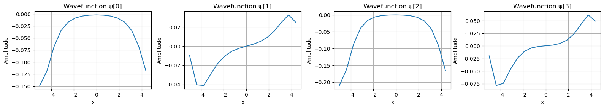
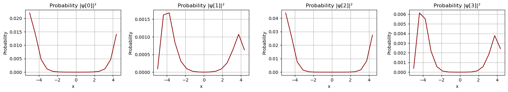
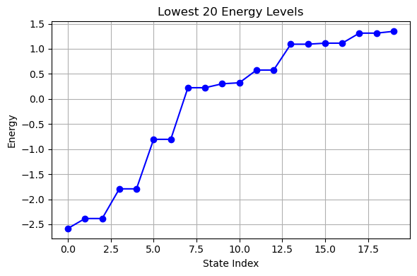

# 1D-DVR-Quantum-Mechanics

A research-grade implementation of the **Discrete Variable Representation (DVR)** method for solving quantum mechanical problems in one spatial dimension. This project simulates a quantum system using quadrature-based discretization, enabling precise numerical solutions of the Schrödinger equation for multi-particle systems. Developed as part of an undergraduate research experience under Dr. Daniel Koenig at NC State University.

---

## 🧠 Project Overview

This repository showcases the application of the **DVR method** to a 1D quantum system composed of multiple indistinguishable particles. The DVR approach transforms the continuous position space into a discrete grid based on **Legendre-Gauss quadrature**, allowing efficient construction and diagonalization of the Hamiltonian.

We solve the **time-independent Schrödinger equation**:

$
\hat{H} \psi(x) = E \psi(x)
$

Where:
- \( \hat{H} \) is the Hamiltonian operator
- \( \psi(x) \) are the eigenfunctions (wavefunctions)
- \( E \) are the quantized energy levels

Key aspects:
- Fast and accurate approximation of differential operators using DVR basis
- Efficient handling of diagonal potential energy operators
- Exact quadrature integration for matrix elements
- Extraction of low-lying energy eigenvalues and corresponding wavefunctions

---

## 🧾 Contents

| File                                 | Description |
|--------------------------------------|-------------|
| `NParticle_DVR_Implementation.ipynb` | Main Python notebook with code, commentary, and visualizations |
| `KOENIG___Research_paper.pdf`        | Formal research report detailing methodology and findings |
| `1.png`                              | Plot of probability densities \( |\psi(x)|^2 \) for the first few states |
| `2.png`                              | Raw wavefunctions \( \psi(x) \) plots |
| `3.png`                              | Discrete plot of lowest 20 computed energy levels |
| `README.md`                          | This documentation file |

---

## 📊 Visualizations

### 🔷 Probability Densities

Shows spatial probability \( |\psi_n(x)|^2 \) for the first four eigenstates, where \( \psi_n \) is the n-th eigenfunction:



---

### 🔷 Raw Wavefunctions

Wavefunction amplitudes \( \psi_n(x) \) across the grid points for the first four states:



---

### 🔷 Energy Spectrum

Scatter plot of the **lowest 20 energy levels** extracted from diagonalization of the Hamiltonian matrix:



---

## 🔬 Physics and Methodology

The DVR approach is particularly powerful for 1D quantum systems where the potential energy operator is diagonal in the coordinate basis. This method avoids the need for finite differences and instead leverages **spectral accuracy** of quadrature rules.

### Steps in the Implementation:
1. **Grid Construction**  
   - Use Legendre-Gauss points to define position space discretization.
   - Nodes and weights form the DVR basis.

2. **Kinetic Energy Matrix**  
   - Constructed from analytical second-derivative matrix elements in DVR.

3. **Potential Energy Operator**  
   - Evaluated directly at DVR nodes (diagonal matrix).

4. **Hamiltonian Assembly**  
   $
   \hat{H} = T + V
   $

5. **Eigenvalue Problem**  
   - Diagonalize the Hamiltonian to obtain \( E_n \) and \( \psi_n(x) \).

6. **Post-Processing**  
   - Plot wavefunctions and probability densities.
   - Visualize discrete energy spectrum.

---

## 💡 Use Cases

- Quantum mechanics education (undergraduate & graduate)
- Teaching numerical methods for Schrödinger equation
- Research prototype for 1D quantum systems
- Comparison against finite-difference and finite-element methods
- Basis for generalization to 2D or higher-dimensional DVR simulations

---

## ⚙️ Requirements

Install dependencies with:

```bash
pip install numpy scipy matplotlib
